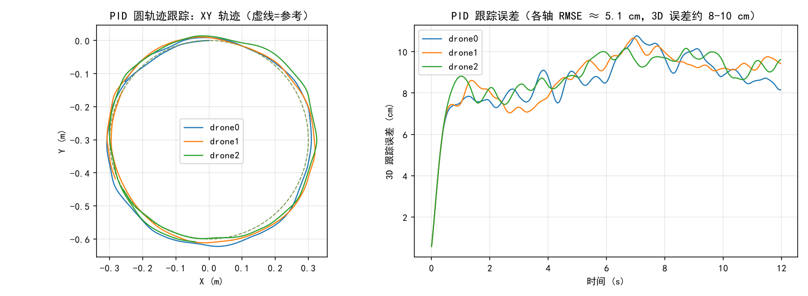
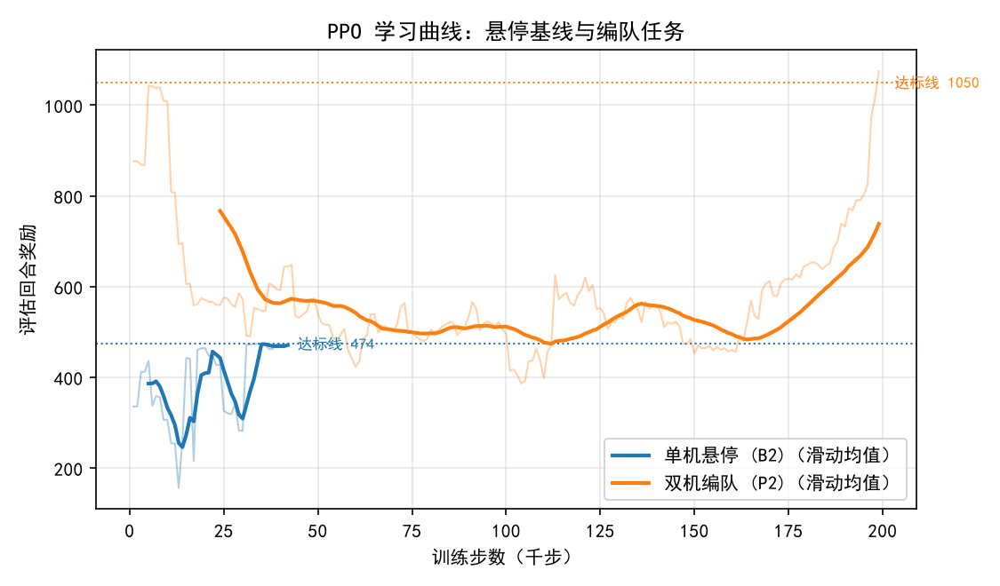
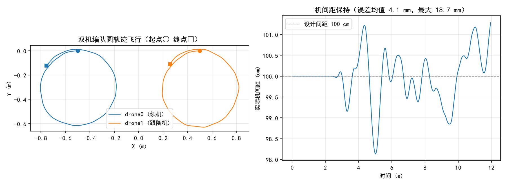
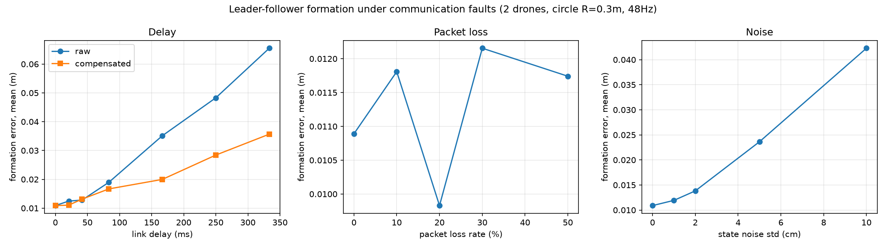
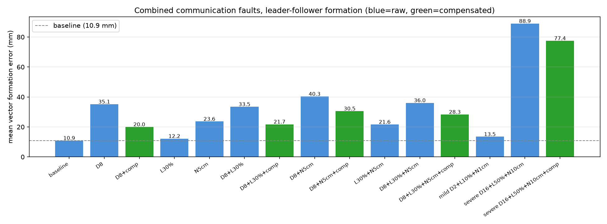

# 通信受限条件下多无人机协同编队控制与鲁棒性评估——项目报告

基于 [gym-pybullet-drones](https://github.com/learnsyslab/gym-pybullet-drones)（IROS 2021）的复现与扩展。
代码版本：fork [ling-kui/gym-pybullet-drones](https://github.com/ling-kui/gym-pybullet-drones) main 分支，基线上游提交 `7ebad1ecabd28a7000add2d05f888aa2e837c2cc`。

---

## 1. 摘要

本项目以 gym-pybullet-drones 仿真环境为基础，围绕"多无人机编队飞行中机间通信受限"这一问题，完成了三阶段工作：

1. **核心复现与基线**：跑通项目全部核心链路，复现论文核心结果（PPO 单机悬停达到原论文达标线 474），并建立 PID 轨迹跟踪与 PPO 悬停两条基线；
2. **编队任务构建**：分别以传统控制（PID 领随）与强化学习（FormationAviary + PPO）实现两机编队保持；
3. **通信故障注入与鲁棒性量化**：构建机间通信链路模型（延迟/丢包/噪声），完成单一与组合故障的因子化扫描，量化编队性能退化，并验证速度外推补偿可恢复约 40-50% 的延迟退化。

核心结论：**延迟是编队性能的首要威胁（333ms 延迟使队形误差达无故障的 6 倍）；丢包在高频控制下近乎无害（50% 丢包仅退化 <2mm）；组合故障呈次加性退化，系统无灾难性相互放大；速度外推补偿在全部含延迟工况下稳定恢复 20-50% 的退化。**

## 2. 复现范围声明

| 原项目内容 | 本项目状态 |
| --- | --- |
| Gymnasium + PyBullet 环境接口（BaseAviary 系列） | ✅ 完整复现（main 分支 `7ebad1e`） |
| PID 轨迹跟踪（pid.py 链路） | ✅ 复现并量化（各轴 RMSE ≈ 5.1cm） |
| PPO 悬停（learn.py 链路，论文核心实验） | ✅ 定量复现：42k 步达到论文达标线 474 |
| IROS 2021 论文完整实验矩阵 | ⚠️ 未逐图复现（`paper` 分支已备置于 `gym-pybullet-drones-paper/`，提交 `fed4046`，需要时可补做） |
| 编队几何 / 通信链路 / 故障注入 | ➕ 原项目没有，本项目的原创扩展（见 §5） |

## 3. 系统与方法

交互式系统架构图见 `report_figures/` 之外的项目内 archify 产物（`../archify/output/gym-pybullet-drones.architecture.html`），涵盖入口层、环境层、控制层、工具层与外部依赖的完整数据流。

### 3.1 仿真与控制

- 仿真：PyBullet，物理 240Hz；控制 48Hz（基线）或 30Hz（RL）；机型 cf2x（Crazyflie 2.x，URDF 参数：质量 27g、桨叶系数 KF=3.16e-10 等）。
- 传统控制：DSLPID 级联 PID（位置环 → 姿态环 → 电机 RPM）。
- 学习控制：Stable-Baselines3 PPO（MlpPolicy），观测为 12 维运动学 + 动作缓冲，动作为归一化转速扰动（ONE_D_RPM）。

### 3.2 编队架构

- **脚本式编队（scripted）**：各机跟踪自身偏置后的参考轨迹，无需通信，作为理想参照。
- **领随编队（leader-follower）**：领机沿参考圆飞行；跟随机目标 = 经通信链路收到的领机位置 + 编队偏置（1m）。链路模型 `CommLink` 支持：
  - **延迟**：样本延迟 N 个控制步送达；
  - **丢包**：每步独立以概率 p 丢弃，接收端保持最近样本（零阶保持）；
  - **噪声**：送达样本叠加高斯噪声（std 可配）。
- **补偿方法**：速度外推（dead reckoning）——用收到的领机速度按样本龄期外推位置 `p_est = p_rx + v_rx·age`。
- **故障边界**：故障仅存在于机间链路，各机自身传感与控制完好（符合课题设定）。

### 3.3 指标

- **矢量队形误差**：`‖p₁ − p₀ − 偏置‖`（方向感知，主指标）；
- 机间距误差 `|‖p₁−p₀‖ − 间距|`；轨迹/槽位跟踪 RMSE（稳态 t>2s）；RL 回合回报。

## 4. 实验结果

### 4.1 基线



- **B1 PID 圆轨迹跟踪**（3 机，R=0.3m，周期 10s，12s）：各轴 RMSE 均方根 **5.1cm**（水平 ~6cm、高度 <2mm）；误差主体为切向滞后与离心偏置。
- **B2 PPO 单机悬停**：42k 步达到论文达标线 474（预算 200k），~620 steps/s（CPU）。



### 4.2 编队保持



| 指标 | PID 领随（scripted 图示为脚本式；领随实测见 §4.3 基线行） | RL（FormationAviary + PPO） |
| --- | --- | --- |
| 回合回报 | —（无回报概念） | **1074.7 ± 0.0 / 1200（89.6%）** |
| 机间距误差（均值） | **0.41 cm** | 9.96 cm |
| 槽位 RMSE（t>2s） | **9.5 / 10.0 cm** | 25.9 / 52.8 cm |

结论：**PID 精确、RL 够用但不精**。RL 精度受限于奖励塑形（四次方项在大偏差时几乎不罚）与提前停止，改进方向为更陡惩罚与更长训练。两条路线为第三阶段提供互补的被测对象。

### 4.3 单一故障退化（领随编队，无故障基线 10.9mm）



- **延迟**：退化随延迟近似线性增长，333ms（16 步）达 65.5mm（**6 倍**）；速度外推补偿在 ≥167ms 时稳定恢复 40-50%（333ms：65.5→35.7mm）。
- **丢包**：10%~50% 丢包仅退化至 9.8~13.2mm——48Hz 下"保持最近样本"等效于平均 ~1 步陈旧，**丢包≈微延迟**，近乎无害。
- **噪声**：近似单调传递（5cm→23.6mm，10cm→42.3mm），PID 位置环起低通衰减作用。

### 4.4 组合故障（因子化：单故障 → 两两 → 三重 → 轻度/重度）



| 配置 | 误差均值 (mm) | 补偿后 (mm) |
| --- | --- | --- |
| 基线 | 10.9 | — |
| D8 / L30% / N5cm（单故障） | 35.1 / 12.2 / 23.6 | 20.0 / — / — |
| D8+L30% | 33.5 | 21.7 |
| D8+N5cm | 40.3 | 30.5 |
| L30%+N5cm | 21.6 | — |
| **D8+L30%+N5cm（三重）** | **36.0** | **28.3** |
| 轻度 D2+L10%+N1cm | 13.5 | — |
| 重度 D16+L50%+N10cm | 88.9（最大 187.5） | 77.4 |

**交互分析**：组合实测均低于加性预测（如 D8+N5cm 实测 40.3 < 预测 47.9）——退化呈**次加性**，无灾难性相互放大；延迟为主导轴；补偿在全部含延迟配置下有效（恢复 20-45%）。工程含义：最恶劣组合下最大瞬时误差 187.5mm 已达 1m 间隔的 1/5，该工况需放大安全间隔或启用更强补偿。

## 5. 创新点（相对原项目）

1. **FormationAviary 编队环境**：原项目仅有点轨迹跟踪与悬停，本项目引入队形几何（槽位 + 相对位置奖励），并暴露出"RL 够用不精、奖励塑形决定精度"的实验结论。
2. **CommLink 机间通信链路模型**：延迟/丢包/噪声三通道可复现注入，故障边界严格限制在机间链路（自机传感完好），与课题设定一致。
3. **领随编队故障注入测试床**：`formation_flight.py` 双模式（scripted/leader-follower）+ 结构化指标返回，确定性、可批量扫描。
4. **因子化组合故障实验与次加性发现**：组合退化低于加性预测的定量结论，为安全间隔设计提供依据。
5. **速度外推补偿及量化收益**：实现简单、在全部含延迟工况稳定恢复 20-50% 退化。
6. **工程贡献**：Windows 原生环境适配（pybullet cp312 本地编译、torch 2.14/SB3 2.9 加载垫片）、全链路可复现脚本（记录提交号/种子/命令）。

## 6. 局限与展望

- 每配置单回合单种子，估计存在毫米级波动 → 正式结论可多种子取均值；
- RL 链路的通信受限版本（观测经链路获取后重新训练/评估）尚未实施；
- 补偿仅一阶外推，可对比二阶外推、Smith 预估器、基于滤波估计的方法；
- 编队规模限于 2 机，FormationAviary 已参数化支持扩展；
- 未复现 `paper` 分支的完整论文实验矩阵（已预留）。

## 7. 复现指南

```bat
:: 环境（Windows，Python 3.12）
python -m venv .venv && .venv\Scripts\activate
pip install -e . -i https://pypi.tuna.tsinghua.edu.cn/simple   :: pybullet 需 MSVC 编译
:: 基线
python -c "from gym_pybullet_drones.examples.pid import run; run(plot=False)"
python baseline_train.py --task hover --timesteps 200000
:: 编队（RL 训练 / PID 演示 / RL 评估）
python baseline_train.py --task formation --timesteps 400000
python formation_flight.py --mode leader-follower --delay_steps 8 --compensate true
python eval_formation.py --episodes 5
:: 故障扫描与图表
python sweep_faults.py
python sweep_combo.py
python make_report_figures.py
```

环境注意事项：pybullet 在 cp312 无预编译包（需 VS Build Tools）；torch 2.14 + SB3 2.9 的模型加载需 `sitecustomize.py` 垫片（见 BASELINE.md）。
